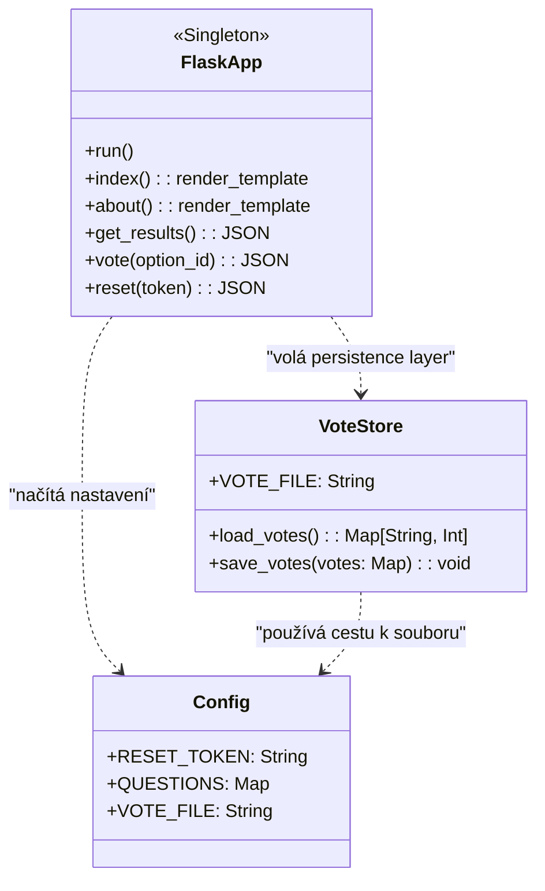
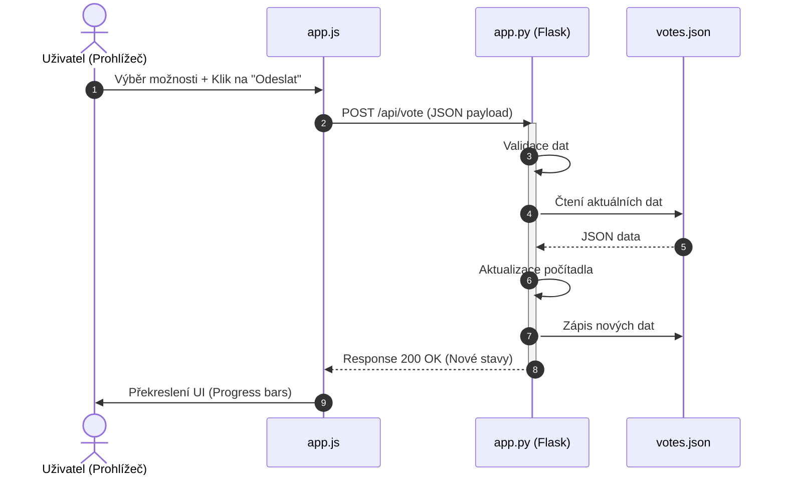
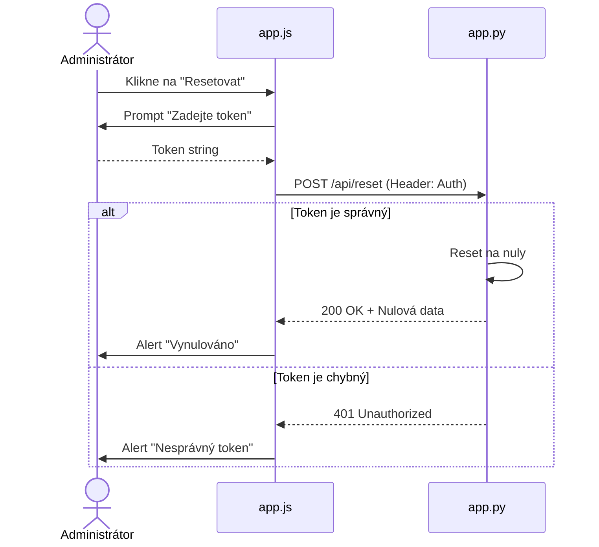

# UML Diagramy - Dokumentace

Tento dokument obsahuje detailní UML diagramy pro aplikaci Anketa.

## 1. Class Diagram (Třídní schéma)
Diagram popisuje statickou strukturu backendu a vztahy mezi moduly.

## 2. Sequence Diagram (Hlasovací proces)
Diagram ukazuje časovou souslednost zpráv při odesílání hlasu.

## 3. Workflow Diagram (Reset hlasování)
Zabezpečený proces vymazání výsledků.

